<picture>
  <source media="(prefers-color-scheme: dark)" srcset="./assets/leaves-night.svg">
  <source media="(prefers-color-scheme: light)" srcset="./assets/leaves-day.svg">
  
</picture>

 

os bancos guardam memórias 
de tudo que já passou.  
o que fiz será esquecido, 
assim como o que restou.  
apenas sigo.

  

<kbd>postgres</kbd> · <kbd>linux</kbd> · <kbd>silêncio</kbd>

<!--
Tudo permanece
Mas ainda muda
Bem levemente
De dia e de noite
O sútil acontece
Quando tudo permanece
-->
